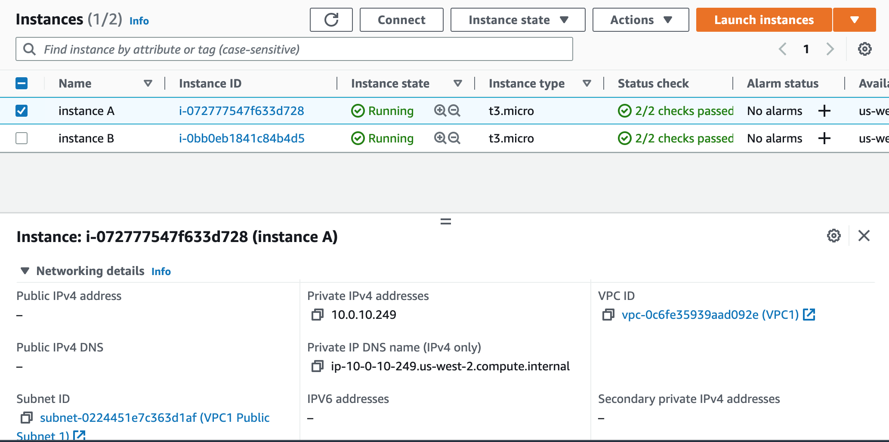

# Networking Lab 1

The first networking lab provides you with the following scenario:  

>Hello, Cloud Support!  
>
>We currently have one virtual private cloud (VPC) with a CIDR range of 10.0.0.0/16. In this VPC, we have two Amazon Elastic Compute Cloud (Amazon EC2) instances: instance A and instance B. Even though both are in the same subnet and have the same configurations with AWS resources, instance A cannot reach the internet, and instance B can reach the internet. I think it has something to do with the EC2 instances, but I'm not sure. I also had a question about using a public range of IP address such as 12.0.0.0/16 for a VPC that I would like to launch. Would that cause any issues? Attached is our architecture for reference.
>
>Thanks!
>
>Jess
>Cloud Admin

We log into an account that has recreated the customer's environment. Immediately, it's clear why the user can't connect to the internet.
One of the instances, instance A, doesn't have a public IP address. If we try to connect to this instance with SSH, we must use the private IP
and not surprisingly, the private IP will not work. Instance B has both a private and public IP and we can connect to it with its public IP with no problems.

I think this was basically the point of the lab and it's not really clear if we were supposed to do any more other than realize that of course we can't connect to one of the instances since it doesn't have a private IP. 
We weren't satisfied with this and wanted to go deeper. Why exactly was the IP on only one of the servers private, and could we do anything to fix it?

It's not clear why only one of the servers has a public IP, since they are on the same subnet were presumably configured similarly. Public IPs should be created by default when creating a new instance, but perhaps the user accidentally toggled this off. Let's see if there's anything we can do to fix this.

 Let's take a look at the subnet settings to make sure. We can either go to the VPC service and look for the subnet tab on the sidebar and find the subnet associated with our instances, or we can stay in the EC2 instance view and click on the subnet in the networking details tab to take us directly there. Once there, making sure that the subnet we want is selected, we click on Actions to bring up the actions menu and click 'Edit subnet settings'.

It seems like 'auto-assign public IPv4 address' was not enabled, so let's enable it and see if this fixes anything.

Unfortunately, this doesn't seem to do anything for our existing instances. If we go back to our EC2 instance view, instance A still doesn't have a public IP. We can try rebooting, or stopping and restarting it, but that doesn't seem to do anything. Instance A still only has a private IP address. I'm not exactly sure what's happening, but my guess is the 'Enable Public IPv4 address' only applies to new instances that are launched on this subnet, not already existing ones.

So we can't give , but it turns out there's a workaround for this, known as Elastic IPs. Elastic IPs will assign a persistent IP to an instance that even after stopping and restarting it, unlike dynamic IPs. However, there are limitations on how many Elastic IPs you can have in a region. On the EC2 service sidebar under networking, there should be an 'Elastic IPs' tab. Clicking on it brings us to a view of existing Elastic IPs, which should be empty. We can click on to allocate a new Elastic IP.

After allocating, there should now be a single Elastic IP. With that IP selected, go to the actions menu, and select 'Associate IP'. In
the Associate IP page, there should be options to associate the IP with a specific instance or network interface. We'll pick instance since
we don't know the network interface off the top of our head. Clicking the instance entry box should bring up a drop down which will let us select instance A. We can leave the private IP blank, which should keep the already existing private IP.

Once we've done all this, if we go back to the EC2 instance view and select Instance A, we should notice that Instance A finally has a public IP. We can confirm by trying to SSH with the new public, which should now work.

